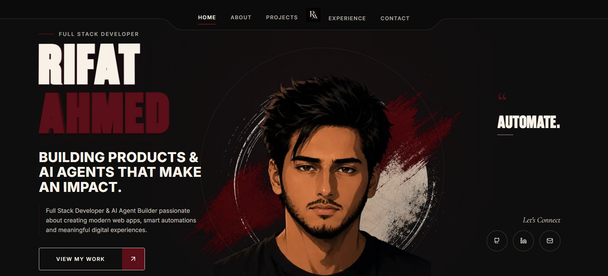
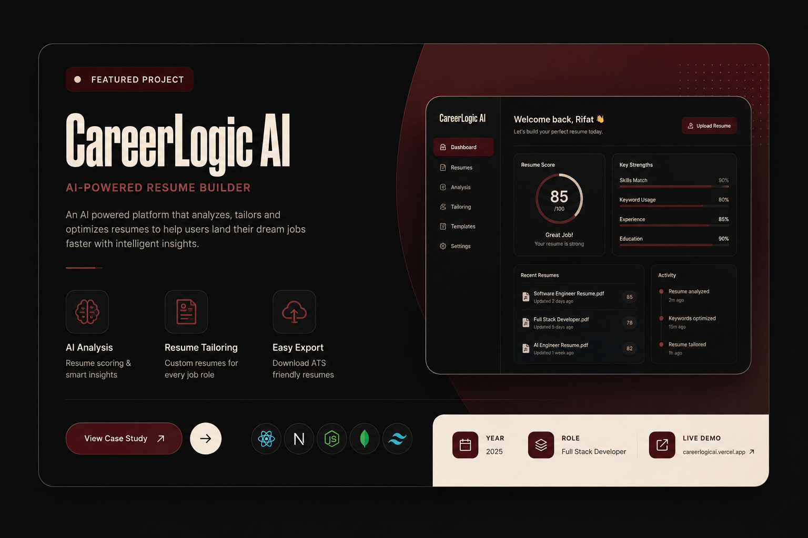
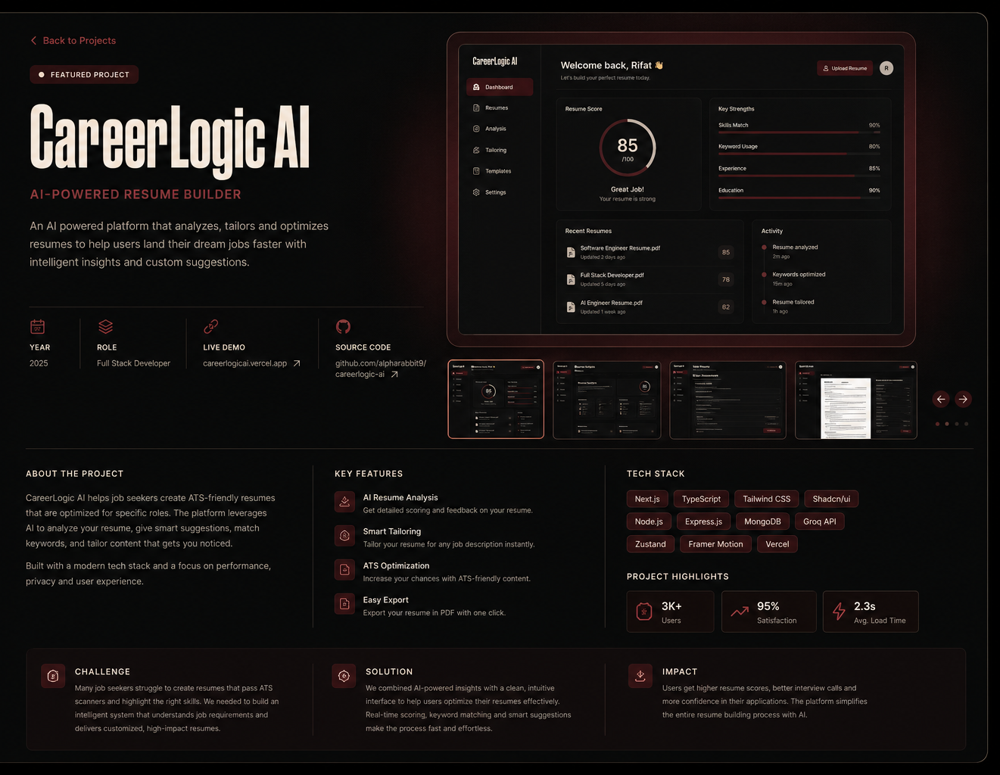

<h1 align="center">Rifat Ahmed — Portfolio</h1>

<p align="center">
  A dark, editorial personal portfolio with a built-in admin CMS —
  every section is editable from the browser, no redeploy required.
</p>

<p align="center">
  
  
  
  
  
  
</p>

---

## What this project is

The personal portfolio site of **Rifat Ahmed** — Full Stack Developer & AI Agent
Builder — built so the owner can run it himself. Content is not hardcoded in the
repo: the bio, the tech stack, every project case study, the contact inbox and
the footer links all live in Supabase and are edited through a private admin
panel at `/admin`. Changing a project or swapping the resume PDF takes a form
submit, not a commit.

Two halves, built section by section and shipped together:

| Half | Route(s) | What it does |
| --- | --- | --- |
| **Public site** | `/`, `/projects/[slug]` | One-page portfolio (Hero → About & Tech Stack → Projects → Career Journey → Contact → Footer) plus a full case-study page per project. |
| **Admin CMS** | `/admin/*` | Supabase-Auth-gated dashboard: edit About, full Projects CRUD with image uploads, manage the Career Journey timeline, read the contact inbox, manage socials + resume. |

Design is not improvised — [Design_System.md](Design_System.md) is the source of
truth for the palette, type scale, spacing, components and motion, and the code
implements it directly.

### Design language

| Token | Value | Used for |
| --- | --- | --- |
| Deep Black | `#0B0B0B` | Page canvas, hero |
| Burgundy Wine | `#5B0F18` | Brand, CTAs, active states |
| Soft Cream | `#F8F1E7` | Headings and primary text |
| Display font | **Brunson** (self-hosted `.woff2` + `.ttf`) | Heavy condensed headlines — caps only |
| Body font | **Inter** | UI and body copy |
| Accent font | **Cormorant Garamond** | Short editorial quotes and captions |

Tokens live once in [styles/globals.css](styles/globals.css) (Tailwind v4
CSS-first, `@theme inline`) and are mirrored in [lib/tokens.ts](lib/tokens.ts)
for the rare JS-side colour.

---

## Features

**Public site**

- **Hero** — extruded 3D display type that tilts toward the pointer, an infinite
  word roll, staggered entrance and social links.
- **About & Tech Stack** — narrative copy with `**highlighted**` spans,
  education cards, and capability groups rendered as logo pills.
- **Projects** — showcase cards driven by the database, with featured ordering
  and a draggable card stack; `/projects` is the full archive of everything
  published.
- **Case study pages** (`/projects/[slug]`) — about, key features, tech stack,
  highlight stats, challenge / solution / impact, and an image gallery.
- **Career Journey** — a single-rail timeline: company logo, period and duration,
  what the company does, what the role owned, and the skills it used.
- **Services** — an editorial row list of what the studio takes on.
- **Achievements** (`/achievements`) — certificates hung on a lit gallery wall,
  each opening full size in a viewer. Its own page, reached from the navbar,
  rather than a band on the home page.
- **Contact** — form posts straight into Postgres; no third-party email service
  in the loop.
- **Motion** — Lenis smooth scrolling, GSAP ScrollTrigger for scroll-*linked*
  choreography and Framer Motion for entrances and hover states, split so the
  two engines never animate the same element. All of it switches off under
  `prefers-reduced-motion`.
- **Discoverability** — Metadata API across every route, generated Open Graph
  cards (including one per case study), `sitemap.xml` and `robots.txt`.
- **Graceful degradation** — every read falls back to seeded sample content if
  its migration has not been applied yet, so the site never renders a hole.

**Admin CMS**

- Email/password sign-in via Supabase Auth, single admin user, `/admin/*` gated
  by [middleware.ts](middleware.ts).
- Dashboard with an unread-message badge and a roadmap nav (unbuilt sections
  show greyed out instead of 404ing).
- Projects: create/edit/delete, draft ↔ published, featured flag, ordering, tag
  and technology entry, multi-image upload to Supabase Storage with one image
  flagged as the showcase.
- Career Journey: section header copy plus per-role entries — dates (month
  precision, or "I currently work here"), description, bullet highlights, skill
  pills, logo upload and reordering.
- Messages: inbox with read/unread triage.
- Footer: social links plus resume upload to a stable public URL.

---

## Screenshots

| Hero | Project card | Case study |
| --- | --- | --- |
|  |  |  |

---

## Tech stack

| Layer | Choice |
| --- | --- |
| Framework | Next.js 15 (App Router), React 19, TypeScript 5.6 |
| Styling | Tailwind CSS v4 (CSS-first `@theme`), custom design tokens |
| Backend | Supabase — Postgres, Row Level Security, Auth, Storage |
| Data access | `@supabase/ssr` server/client/middleware clients + Server Actions |
| Motion | Framer Motion 13, Lenis smooth scroll |
| Icons | Lucide React |
| Fonts | `next/font/local` (Brunson) + `next/font/google` (Inter, Cormorant Garamond) |
| Hosting | Vercel |

---

## Getting started

### Prerequisites

- Node.js 20+
- A Supabase project (free tier is fine)

### 1. Install

```bash
npm install
```

### 2. Environment

```bash
cp .env.local.example .env.local
```

Fill it in from **Supabase → Project Settings → API**:

| Variable | Purpose |
| --- | --- |
| `NEXT_PUBLIC_SUPABASE_URL` | Project URL (browser + server) |
| `NEXT_PUBLIC_SUPABASE_ANON_KEY` | Anon key — RLS does the gating |
| `SUPABASE_SERVICE_ROLE_KEY` | **Server-only.** Used solely by the admin-provisioning script |
| `ADMIN_EMAIL` / `ADMIN_PASSWORD` | Credentials for the one admin user |
| `NEXT_PUBLIC_SITE_URL` | Optional. Canonical origin for OG images, canonicals, `robots.txt` and `sitemap.xml`. Falls back to the Vercel deployment host, then `http://localhost:3000` — set it once a real domain is attached |

`.env*.local` is gitignored — never commit real keys.

### 3. Apply the database migrations

There is no local database connection string, so migrations are applied **by
hand**: open the **Supabase SQL editor**, paste each file from
[supabase/migrations/](supabase/migrations/) in order, and run it. Every file is
idempotent — re-running one changes nothing.

| File | Creates |
| --- | --- |
| `0002_about_and_skills.sql` | `about`, `education`, `skill_groups`, `skills` |
| `0004_projects.sql` | `projects`, `project_images`, `media` storage bucket |
| `0004_projects_demo_seed.sql` | Three placeholder projects (delete once real work ships) |
| `0005_project_case_study.sql` | Case-study columns: `about`, `highlights`, `challenge`, `solution`, `impact` |
| `0006_career_journey.sql` | `career_section` + `career_journey`, seeded with the first role |
| `0007_contact_messages.sql` | `contact_messages` (anon insert, admin read) |
| `0008_social_links_and_resume.sql` | `social_links` + `resume` storage bucket |

> Numbering follows the build phases, so the gaps (0001, 0003) are expected —
> those phases ship no schema of their own.

### 4. Create the admin user

```bash
npm run create-admin
```

Reads `ADMIN_EMAIL` / `ADMIN_PASSWORD` from `.env.local` and provisions the
single Supabase Auth user. Idempotent — running it twice reports the existing
user rather than erroring.

### 5. Run it

```bash
npm run dev
```

- Public site → <http://localhost:3000>
- Admin panel → <http://localhost:3000/admin> (redirects to `/admin/login`)

### Scripts

| Command | Does |
| --- | --- |
| `npm run dev` | Start the dev server |
| `npm run build` | Production build |
| `npm start` | Serve the production build |
| `npm run lint` | ESLint (flat config) |
| `npm run create-admin` | Provision the Supabase admin user |

---

## Project structure

```
app/
  layout.tsx                 root layout — fonts, globals.css, smooth scroll
  page.tsx                   the one-page portfolio (sections in order)
  projects/[slug]/           public case-study page
  admin/
    login/                   Supabase email + password sign-in
    (dashboard)/             gated shell: nav, about, projects, messages, footer
features/                    one folder per site section
  hero/ about/ projects/ career/ contact/ footer/
    *-section.tsx            public UI
    data.ts                  server-side reads (with fallbacks)
    actions.ts               "use server" mutations
components/
  ui/                        design-system primitives (Button, Card, Badge, …)
  motion/                    Framer Motion primitives (reveal, parallax, stack…)
lib/
  supabase/                  client / server / middleware clients
  fonts.ts  tokens.ts  utils.ts
styles/globals.css           Tailwind v4 theme + design tokens
supabase/migrations/         hand-applied SQL
public/                      fonts, images
middleware.ts                keeps the Supabase session fresh, gates /admin
Design_System.md             visual source of truth
```

### Conventions worth knowing

- **`data.ts` vs `actions.ts`** — reads live in `data.ts` as plain server
  functions. Anything exported from a `"use server"` module becomes a callable
  RPC endpoint, so read helpers are deliberately kept out of `actions.ts`.
- **Fallback-first reads** — if a table is missing, the section renders seeded
  sample content. A table that exists but is *empty* is respected as-is: that
  means the admin deleted the rows on purpose.
- **Motion components are local ports.** Registry components that would pull in
  a second copy of Framer Motion (as `motion/react`) were rebuilt in
  [components/motion/](components/motion/) against the existing dependency.
- **Brunson is caps-only** — it has no lowercase glyphs, so casing utilities
  cannot produce a mixed-case headline.
- **Storage:** `media` (project images, public read) and `resume` (the CV at a
  fixed object key, so the public URL never changes).

---

## Security model

- All tables run with **Row Level Security**. Anonymous visitors get read access
  to published content only; drafts and the contact inbox are invisible to them.
- `contact_messages` allows anonymous `INSERT` and nothing else — reads and
  updates require the authenticated admin.
- The service-role key is used exclusively by
  [scripts/create-admin-user.ts](scripts/create-admin-user.ts) and never reaches
  the browser.

---

## Roadmap

| # | Section | Public | Admin |
| --- | --- | :---: | :---: |
| 1 | Hero | ✅ | ✅ |
| 2 | About & Tech Stack | ✅ | ✅ |
| 3 | Projects + case studies + `/projects` index | ✅ | ✅ |
| 4 | Career Journey | ✅ | ✅ |
| 5 | Services | ✅ | ✅ |
| 6 | Contact | ✅ | ✅ |
| 7 | Footer | ✅ | ✅ |
| 8 | Achievements (`/achievements`) | ✅ | ✅ |
| 9 | Cross-cutting polish | ✅ | — |

Phase 9 shipped the Metadata API pass (title template, canonicals, generated
Open Graph cards per route and per project), `sitemap.xml` / `robots.txt`, the
site-wide reduced-motion switch and a responsive sweep. Vercel Analytics is
deliberately **not** installed — it is a two-line addition
(`npm i @vercel/analytics`, then `<Analytics />` in the root layout) whenever
it is wanted.

---

## Deployment

Deploys to **Vercel**: import the repo, add the same environment variables from
`.env.local`, and ship. Schema changes still go to Supabase by hand — there is
no staging database, so take a backup before anything destructive.

Two pieces of config already in [next.config.ts](next.config.ts) matter in
production:

- `images.remotePatterns` allow-lists `*.supabase.co/storage/v1/object/public/**`
  so `next/image` can optimise uploaded media.
- `outputFileTracingIncludes` copies `public/fonts/*.ttf` next to the
  `opengraph-image` functions — they read Brunson and Inter off disk at request
  time, and without it every social card renders in a fallback face.

After the first deploy:

1. Set `NEXT_PUBLIC_SITE_URL` to the real domain (Vercel's own host is used
   until you do, which is fine for a preview and wrong for a custom domain).
2. Check `/robots.txt` and `/sitemap.xml` — the sitemap lists `/`, `/projects`,
   `/achievements` and every published case study.
3. Paste the deployed URL into any link unfurler and confirm the Open Graph
   card renders with the display face, then submit the sitemap in Google Search
   Console.

---

## Credits

Designed and built by **Rifat Ahmed**. The visual system is documented in
[Design_System.md](Design_System.md); the CareerLogic AI starter theme this repo
was scaffolded from is preserved in
[careerlogic_README.md](careerlogic_README.md).
